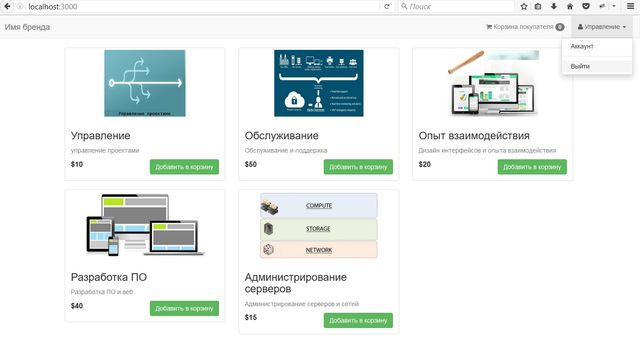
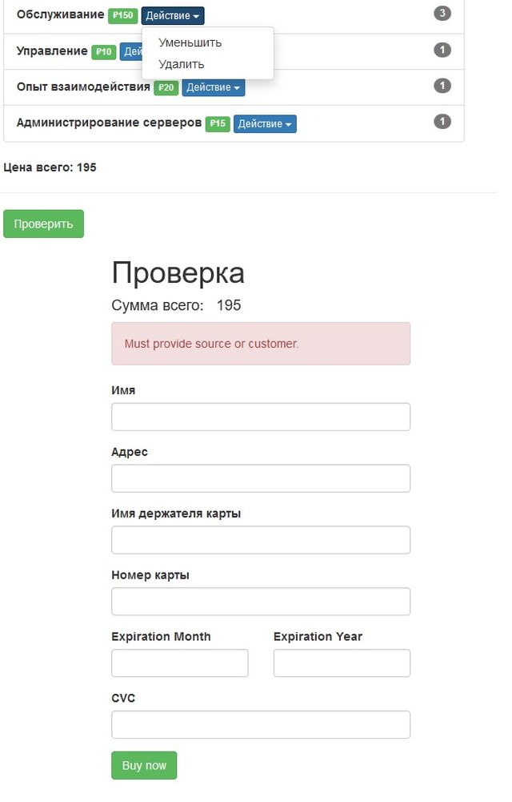

### Корзина покупателя

 - **Каталог товаров**

 - **Заказ и оплата покупки:**

#### NodeJS приложение для заказа и оплаты товаров:

* express
* hbs
* mongoose
* passport
* stripe

#### Основные возможности

Хранение и вывод информации о товарах на страницу. Возможность заказать и оплатить покупку. (интегрированна система оплаты https://stripe.com/)

* регистрация новых пользователей
* авторизация и аутентификация
* отображение корзины покупателя
* оплата онлайн (пока только зарубежная биржа - https://stripe.com/)
* отображение заказов из корзины покупателя, в случае успешной оплаты

#### Установка и настройка
* *git clone* https://github.com/it-spectre-ru/nodejs-shopping-cart.git - **скопируйте репозиторий к себе**
* *cd shopping-cart* - **перейдите в папку с проектом**
* *npm i*  - **установите зависимости**
* *в файлах app.js и product-seed.js измените путь до mongo db*  - **вот так -  localhost:8088/shopping **
* *npm start* - **старт приложения**

#### Получить помощь
[Ваши пожелания и замечания](https://github.com/it-spectre-ru/nodejs-shopping-cart/pulls)

#### Смотрите также
* [Лицензия](./LICENSE.MD)
